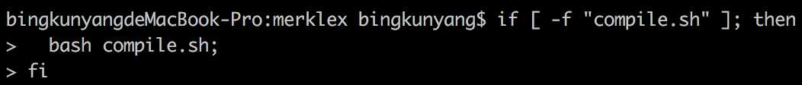
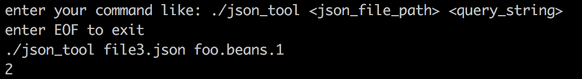
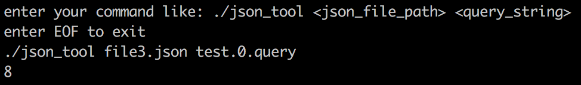

# Project Description

A. How to use this tool?(Need to build the project first)  
1. Open terminal and enter the root of the project; 
2. Enter the following bash code: 
if [ -f "compile.sh" ]; then
  bash compile.sh;
fi

Tips:
Since this is maven project, you can use maven to build it to be jar file.(cmd:/usr/local/Cellar/maven/3.5.2/bin/mvn clean compile package) 

The steps are like before: 
Compile + bash  

The following are the result for demo: <br/ >

Run the bash:  
  

Demo1:  
  

Demo2:  
  

Demo3:  
  

Demo4:  
  

